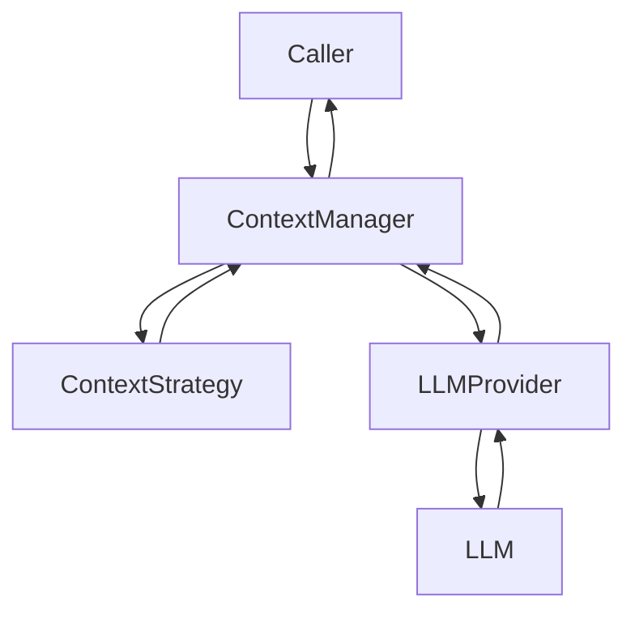
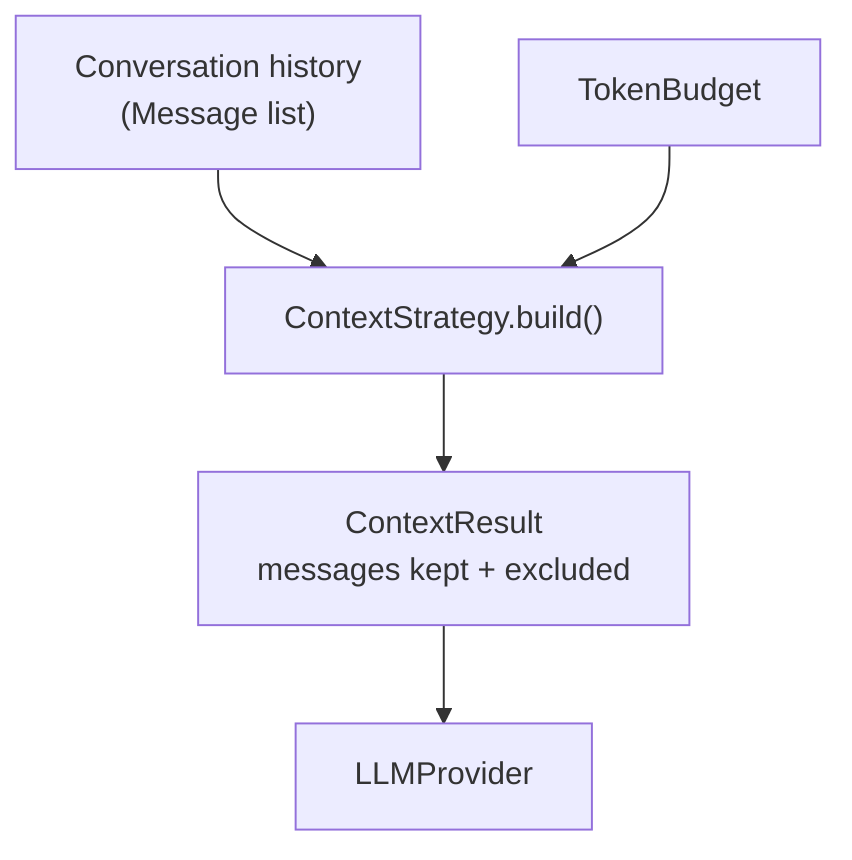
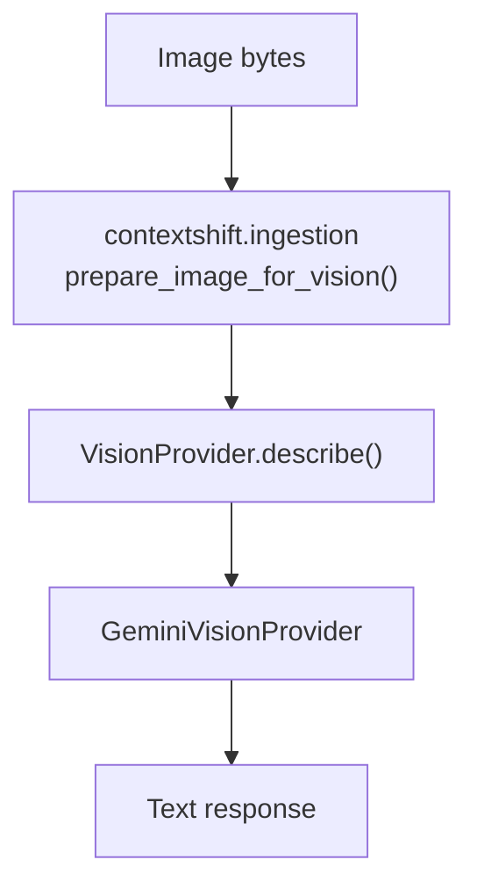
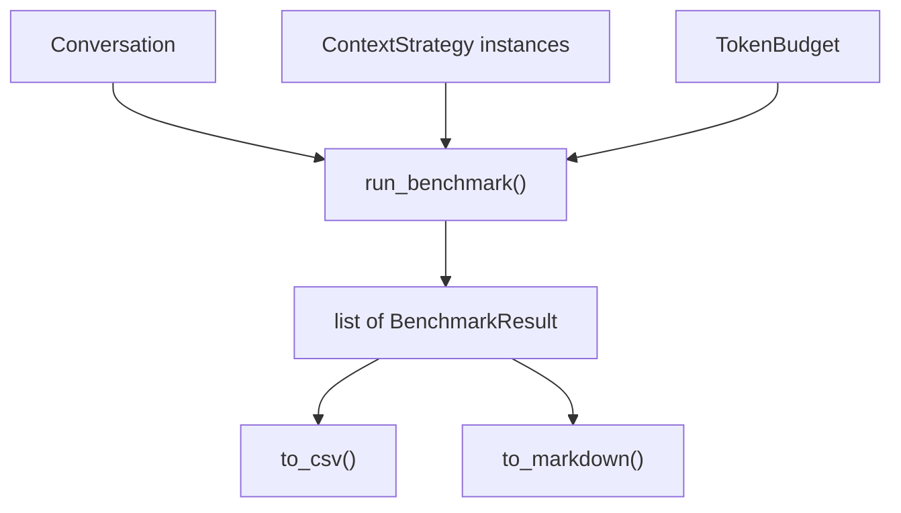
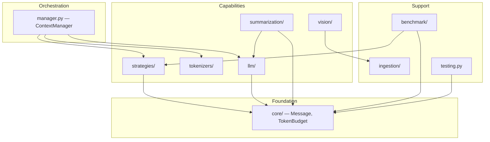

# ContextShift

A Python framework for context engineering: deciding what an LLM sees on
each turn, under a token budget, as an explicit and swappable policy
instead of an implicit side effect of application code.

## What is ContextShift?

Every multi-turn LLM application eventually faces the same problem: the
conversation grows past what's worth sending to a model on every turn,
whether because it exceeds the context window outright or because
sending irrelevant history wastes tokens, latency, and money on content
that doesn't matter to the current turn. Cost and latency scale with
tokens sent, regardless of whether those tokens are relevant.

The usual response is ad hoc: truncate the oldest messages, summarize
occasionally, or simply rely on the model's context window and hope it's
large enough. This logic is typically implemented once, inline, tangled
up with whatever web framework and database the application happens to
use — which makes it untestable in isolation and impossible to compare
against an alternative.

A larger context window does not solve this. It only delays the point at
which a deliberate policy becomes necessary, at increasing cost per turn.
ContextShift exists to make that policy explicit: a **strategy** decides
which messages belong in context under a token budget; a **provider**
decides how to actually talk to a model; a **manager** composes the two
into a single call. Each piece is a small, swappable interface, testable
without a network connection, and independently comparable via a
built-in benchmark.

**Who this is for:** anyone building a multi-turn LLM application (a
chat product, a CLI assistant, an agent) who needs an explicit, testable
policy for what a model sees each turn — and anyone comparing
context-management strategies against each other, since that comparison
is a first-class, built-in capability rather than something to build
from scratch.

## Philosophy

ContextShift focuses on three things:

- **Context selection** — deciding which messages fit a token budget.
- **Orchestration** — composing a strategy and a provider into one call.
- **Benchmarking** — comparing strategies on measurable, deterministic
  properties.

It deliberately does not do:

- **Vector databases or retrieval infrastructure.** ContextShift selects
  from a candidate list it's given; it doesn't fetch that list from
  anywhere. A strategy backed by retrieval is expressible on top of this
  library, but owning a specific vector store binding would only be
  useful to whoever chose that store.
- **Agent frameworks or tool-calling orchestration.** A different
  capability, with a different consumer, than deciding what a model
  sees.
- **Prompt engineering or prompt template management.** What a system
  prompt says is an application's decision, not the library's — every
  interface in ContextShift (strategies, providers, the manager) is
  scoped to *where* prompt framing goes, never *what* it says.

**Design principles:**

- **A field, method, or export exists because something concretely
  needs it**, not because it might be useful someday. Every abstraction
  in this codebase traces back to a real, existing consumer.
- **Interfaces are structural `Protocol`s, not `ABC`s.** A `Tokenizer`,
  a `ContextStrategy`, an `LLMProvider`, a `VisionProvider` is defined
  entirely by having a matching method. A conforming implementation
  needs no dependency on ContextShift itself.
- **Dependencies flow one direction only.** The library never imports
  from the example application; within the library, core types depend
  on nothing, and every other subpackage depends only on what its job
  actually requires.
- **Every decision is inspectable.** A strategy's result exposes what
  it kept and what it excluded; nothing is hidden inside a side effect.
- **No framework-owned persistence.** ContextShift has no database,
  no session concept, and no memory abstraction — an application or
  eval harness owns storage; the library owns the selection policy.

The full reasoning behind each of these is recorded in
[`docs/decisions/`](docs/decisions/) as they were decided, not
reconstructed after the fact.

## Features

- **`ContextManager`** — composes a strategy, a tokenizer, and a
  provider into a single chat turn (`chat()` / `stream_chat()`).
- **Three `ContextStrategy` implementations** — `PinnedRecencyStrategy`,
  `RecencyStrategy`, `SlidingWindowStrategy` — each a different,
  genuinely distinct policy for what survives a token budget.
- **A `Tokenizer` abstraction** — `HeuristicTokenizer` today; the
  interface (`estimate_tokens(text) -> int`) has no dependency on
  message shape or vendor, so a tiktoken-backed or provider-native
  tokenizer is a drop-in second implementation.
- **An `LLMProvider` abstraction** — `GroqProvider` today; vendor-neutral
  by design (`complete()` / `stream()`, nothing Groq-specific in the
  interface).
- **A `VisionProvider` abstraction** — `GeminiVisionProvider` today;
  structurally separate from `LLMProvider` (a vision call has no
  conversation history and a different request shape).
- **A benchmark framework** — deterministic comparison of
  `ContextStrategy` implementations, with CSV and Markdown export.
- **Public testing utilities** — `FakeLLMProvider`, an in-memory
  `LLMProvider` for building against ContextShift with no network
  access.
- **Document ingestion** — PDF text extraction and image preprocessing,
  as pure functions with no model dependency.
- **Zero web-framework dependency.** `contextshift/` never imports
  Flask, SQLAlchemy, or anything application-specific — it's equally
  usable from a CLI, a notebook, or an eval harness. The Flask chat
  application in this repository is one example consumer, not the
  project.

## Architecture

### High-level architecture



`ContextManager.chat()` selects context via a strategy, then calls a
provider with the result. Both dependencies are plain constructor
arguments — any object satisfying the relevant `Protocol` works,
including a fake with no network access.

### Strategy flow



A strategy's output is transparent: `ContextResult.messages` is what
survived, `ContextResult.excluded` is what didn't — inspectable
directly, not something a caller has to re-derive.

### Vision flow



Preprocessing (resize, format normalization) is a separate concern
from calling a vision model — a `VisionProvider` never resizes or
re-encodes an image itself.

### Benchmark flow



Every strategy runs against identical input; nothing in this path calls
a model or a network.

### Framework package layout



`core/` depends on nothing else in the package; every other subpackage
depends only on what its own job requires. See
[`docs/architecture.md`](docs/architecture.md) for the complete
dependency rules and rationale.

## Installation

```bash
git clone <this-repository-url>
cd ContextShift
python3 -m venv venv
```

Activate the virtual environment:

```bash
source venv/bin/activate        # Linux / macOS
venv\Scripts\activate           # Windows
```

Then install the framework:

```bash
pip install -e .
```

This installs `contextshift` and its runtime dependencies
(`requests`, `PyPDF2`, `Pillow`, `google-genai`) in editable mode, so
`import contextshift` works from anywhere on your machine — this is
what you want if you're using ContextShift as a library in your own
project.

If you only want to run the example Flask application in this
repository, `pip install -e .` is not required on its own — see
[Example Application](#example-application) below, whose
`requirements.txt` already includes everything the app needs, and works
because `python app.py` is run from inside this repository (Python
resolves the local `contextshift/` directory directly). Use
`pip install -e .` for using the library elsewhere; use
`requirements.txt` for running the demo app in place. There's no harm
in installing both.

## Quick Start

```python
from contextshift import ContextManager
from contextshift.core import TokenBudget
from contextshift.strategies import PinnedRecencyStrategy
from contextshift.testing import FakeLLMProvider
from contextshift.tokenizers import HeuristicTokenizer

manager = ContextManager(
    strategy=PinnedRecencyStrategy(recent_buffer=2),
    provider=FakeLLMProvider(complete_response="Paris."),
    tokenizer=HeuristicTokenizer(),
    budget=TokenBudget(max_tokens=100, safety_margin=10),
)

result = manager.chat([], "What's the capital of France?")
print(result.response)          # "Paris."
print(result.context.messages)  # what the strategy kept
```

Swap `FakeLLMProvider` for `contextshift.llm.GroqProvider` (or any other
`LLMProvider`) to call a real model — no other code changes. A fuller,
runnable version, including that swap, is in
[`examples/quickstart.py`](examples/quickstart.py):

```bash
python examples/quickstart.py
```

## Context Strategies

| Strategy | Policy | Pinning | Use when |
|---|---|---|---|
| `PinnedRecencyStrategy` | Protects a fixed recency window and all pinned messages; prunes older messages first, budget-driven | Yes | Some messages (system instructions, user-starred content) must never be dropped regardless of age |
| `RecencyStrategy` | Keeps as much of the conversation's tail as fits the budget — no fixed window, no configuration | No | The simplest baseline: pure recency, nothing else |
| `SlidingWindowStrategy` | Keeps a fixed number of the most recent messages by count; budget is a secondary ceiling on that window | No | A predictable message count matters more than fully using the available budget |

All three implement the same `ContextStrategy` protocol
(`build(messages, budget) -> ContextResult`) and are drop-in
replacements for each other — swapping strategies never requires
changing `ContextManager`, another strategy, or the application that
consumes them.

## Benchmarking

Comparing strategies by intuition doesn't scale past the first one.
`contextshift.benchmark` runs every strategy against identical input and
reports what the library already knows — no LLM call, no external
service, fully deterministic.

**Metrics measured:** messages kept, messages discarded, tokens kept,
tokens discarded, percentage of tokens retained, and selection latency.

```python
from contextshift.benchmark import run_benchmark, to_markdown
from contextshift.strategies import PinnedRecencyStrategy, RecencyStrategy, SlidingWindowStrategy

results = run_benchmark(
    conversation,
    budget,
    [RecencyStrategy(), SlidingWindowStrategy(window_size=10), PinnedRecencyStrategy(recent_buffer=6)],
)
print(to_markdown(results))
```

```
| Strategy | Kept | Discarded | Tokens Kept | Tokens Discarded | % Retained | Latency (s) |
| --- | --- | --- | --- | --- | --- | --- |
| RecencyStrategy | 32 | 9 | 880 | 228 | 79.42% | 0.000024 |
| SlidingWindowStrategy | 10 | 31 | 275 | 833 | 24.82% | 0.000004 |
| PinnedRecencyStrategy | 33 | 8 | 888 | 220 | 80.14% | 0.000028 |
```

`to_csv()` renders the same results as CSV. Neither function prints —
both return a string, so writing to a file or stdout is a caller
decision.

## Vision

`VisionProvider` (`describe(image_bytes, mime_type, prompt=None) -> str`)
is a separate capability from `LLMProvider`, not an extension of it — a
vision call takes a single image and prompt, not a conversation history,
and its request shape is structurally different from a chat completion.
`prompt=None` requests a general description; a supplied prompt guides
what the model looks for instead.

`GeminiVisionProvider` is the current implementation, backed by Google's
Gemini API. It never preprocesses an image itself — every call routes
through `contextshift.ingestion.prepare_image_for_vision()` first
(resize, palette/RGBA-to-RGB conversion, JPEG re-encoding), the same
separation of concerns the rest of the library applies between
transport and everything else.

## Testing

`contextshift.testing.FakeLLMProvider` is an in-memory `LLMProvider` —
no network calls, no API key, no HTTP. It exists so a CLI, a notebook,
an eval harness, or this repository's own test suite can build and test
code against ContextShift without a real model behind it. It's the one
deliberate exception to keeping the top-level public surface minimal:
everything else is imported from its owning subpackage, but a fake
provider is common enough infrastructure for building *against* this
library that it's worth a dedicated, public, non-test-only home.

```python
from contextshift.testing import FakeLLMProvider

provider = FakeLLMProvider(complete_response="mocked reply")
provider.complete([...])  # -> "mocked reply", no network involved
```

## Project Structure

```
contextshift/           The framework. Zero Flask/SQLAlchemy dependency.
  core/                   Message, TokenBudget — plain domain types
  tokenizers/             Tokenizer protocol + HeuristicTokenizer
  strategies/             ContextStrategy protocol + three strategies
  llm/                    LLMProvider protocol + GroqProvider
  vision/                 VisionProvider protocol + GeminiVisionProvider
  summarization/          Summarizer, built on LLMProvider
  ingestion/              PDF extraction, image preprocessing
  benchmark/              Deterministic ContextStrategy comparison
  manager.py              ContextManager — orchestration entry point
  testing.py              FakeLLMProvider — public test double

examples/                Small, runnable, standalone usage examples.

docs/
  architecture.md         The current architecture: layers, dependency
                           rules, guiding principles.
  decisions/               Architecture Decision Records — why specific
                            choices were made.
  diagrams/                 Mermaid source for the architecture diagrams.
  roadmap.md                 Where the project is headed.

tests/                   Test suite for contextshift/ and the example app.

app.py, adapters.py,     The example Flask application: a chat UI
models.py, config.py,    demonstrating ContextShift in a real, working
templates/, static/      product. Not the framework itself.

utils/                   Original, pre-extraction implementations, kept
                         solely as characterization-test reference
                         points (see Testing below) — not used by the
                         running application.
```

## Design Documents

[`docs/decisions/`](docs/decisions/) records why specific architectural
choices were made, including alternatives considered and rejected —
read in numeric order, they trace the library's evolution from a
single-file Flask application into this framework.
[`docs/architecture.md`](docs/architecture.md) is the current-state
companion: what the architecture *is*, not the history of how it got
there. [`docs/roadmap.md`](docs/roadmap.md) tracks what's done and
what's next.

## Future Work

- `HybridStrategy`, composed from the existing strategies rather than a
  new algorithm.
- Additional `LLMProvider` implementations.
- Additional `Tokenizer` implementations.

## Example Application

A small Flask chat app in this repository demonstrates the framework in
a real product — streaming chat, PDF upload, image analysis, pinning,
and summarization, all routed through `contextshift/` via `adapters.py`.

```bash
pip install -r requirements.txt
cp .env.example .env   # then fill in GROQ_API_KEY and GEMINI_API_KEY
python app.py
```

Open `http://localhost:5000`. A live deployment also runs at
[context-shift.vercel.app](https://context-shift.vercel.app/).

| Variable | Required | Used for |
|---|---|---|
| `GROQ_API_KEY` | Yes | Chat and summarization, via `GroqProvider` |
| `GEMINI_API_KEY` | Only for image upload | Image understanding, via `GeminiVisionProvider` |
| `FLASK_DEBUG` | No (default `true`) | Flask debug/reload mode |
| `FLASK_PORT` | No (default `5000`) | Port the example app listens on |
| `DATABASE_URL` | No (defaults to local SQLite) | Database connection string |

## Running the Tests

```bash
pip install -r requirements-dev.txt
pytest
pyflakes contextshift/ tests/ app.py adapters.py
```

Coverage spans the `contextshift` library (independent of Flask, no
network access required — fake providers satisfy every interface),
every route in the example application, and characterization tests
proving currently-ported logic behaves identically to the original
implementation it replaced. `pyflakes` (static analysis — unused
imports, undefined names) has been run clean at every step of this
project's development and is included in `requirements-dev.txt` for the
same check locally.

## Contributing

Issues and pull requests are welcome. An issue describing what you'd
like to change before starting on a pull request is the best way to
check it fits the architecture in
[`docs/architecture.md`](docs/architecture.md).

## Security

`.env` (containing your `GROQ_API_KEY` and `GEMINI_API_KEY`) and local
database files are excluded via `.gitignore` and never committed. Keep
your `.env` file private.

## License

MIT — see [`LICENSE`](LICENSE).
